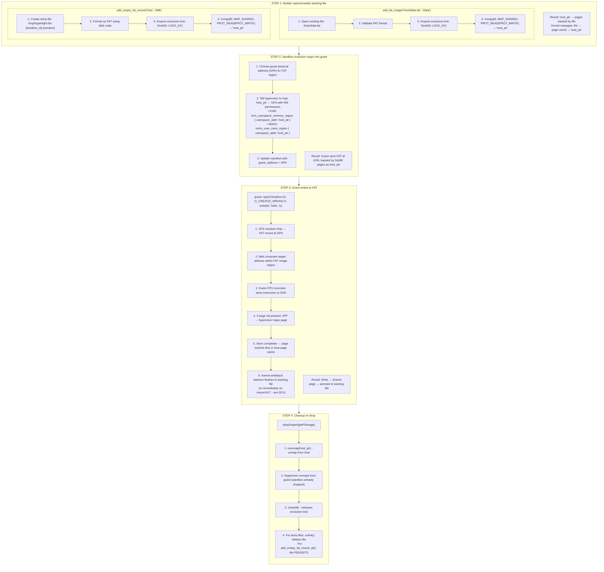
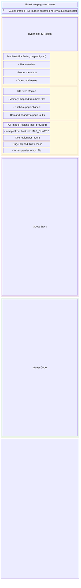
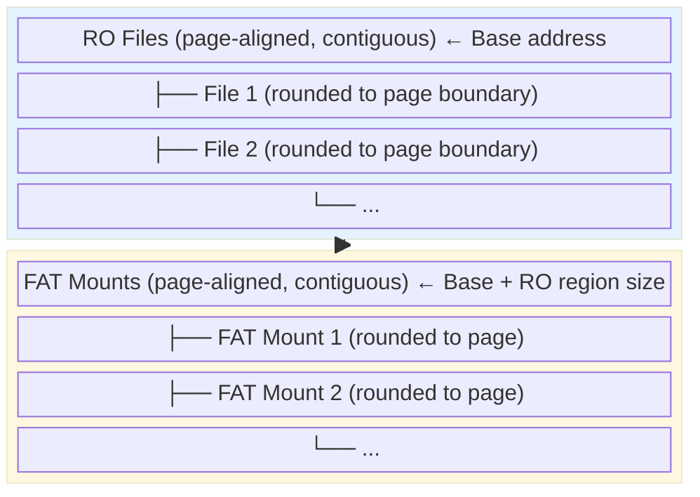

# HyperlightFS Specification

## Table of Contents

1. [Overview](#overview)
2. [Architecture](#architecture)
3. [File System Types](#file-system-types)
4. [Host APIs](#host-apis)
5. [Guest APIs](#guest-apis)
6. [C API Reference](#c-api-reference)
   - [POSIX Compliance Notes](#66-posix-compliance-notes)
7. [Mount Points and Namespace](#mount-points-and-namespace)
8. [Data Serialization](#data-serialization)
9. [Memory Layout](#memory-layout)
10. [Permissions and Metadata](#permissions-and-metadata)
11. [Error Handling](#error-handling)
12. [Security Considerations](#security-considerations)
13. [Limitations](#limitations)
14. [Dependencies and Risks](#dependencies-and-risks)
15. [Future Features](#future-features)

---

## 1. Overview

HyperlightFS is the filesystem subsystem for Hyperlight sandboxes. It provides a unified interface for guests to access files through two distinct backing storage mechanisms:

### 1.1 Read-Only Memory-Mapped Files 

- **Zero-copy**: Host files are memory-mapped (`mmap`) directly into guest address space
- **Read-only**: Enforced at kernel level via `PROT_READ`
- **Demand-paged**: File pages loaded on-demand via page faults
- **Shareable**: Multiple sandboxes can share the same mappings via OS page cache

### 1.2 Read-Write FAT Filesystems

- **Mutable**: Full read/write access to files and directories
- **FAT filesystem**: Industry-standard filesystem via `fatfs` crate (auto-selects FAT12/16/32 based on volume size)
- **Zero-copy via MAP_SHARED**: Host file is mmap'd with `MAP_SHARED`, then the same physical pages are mapped into guest address space
- **Auto-persist**: Guest writes go to page cache → OS flushes to backing file asynchronously
- **Exclusive**: Each backing file locked to one sandbox at a time

### 1.3 Design Goals

1. **Unified guest API**: Same functions work for both RO and RW files
2. **Explicit mapping**: Nothing exposed unless explicitly configured
3. **Type safety**: Clear distinction between mutable and immutable content
4. **Minimal overhead**: Zero-copy for both RO and RW paths
5. **POSIX compatibility**: C API follows libc conventions

---

## 2. Architecture

```mermaid
flowchart TB
    subgraph HOST["HOST PROCESS"]
        subgraph Builder["HyperlightFSBuilder"]
            B1["add_file('/host/config.json', '/config.json') [RO mmap]"]
            B2["add_dir('/host/assets', '/assets') [RO mmap]"]
            B3["add_fat_image('/host/data.fat', '/data') [RW FAT]"]
            B4["add_empty_fat_mount('/tmp', 1MB) [RW FAT]"]
            B5["add_empty_fat_mount_at('out.fat', '/out', 1MB) [RW FAT]"]
            B6["build() → HyperlightFSImage"]
        end
        
        subgraph Image["HyperlightFSImage"]
            I1["Manifest (FlatBuffer serialized metadata)"]
            I2["RO file mappings (mmap PROT_READ pointers + metadata)"]
            I3["FAT image mappings (mmap MAP_SHARED, exclusive lock)"]
            I4["Host file access APIs (read/write/list)"]
        end
        
        subgraph Sandbox["Sandbox"]
            S1["Guest memory with FS regions mapped"]
            S2["File access APIs (read/write during pause)"]
            S3["Extraction APIs (get FAT data after execution)"]
        end
        
        Builder --> Image
        Image --> Sandbox
    end
    
    subgraph GUEST["GUEST VM"]
        subgraph Memory["Guest Memory Layout"]
            M1["Manifest region (FlatBuffer with file/mount metadata)"]
            M2["RO files region (demand-paged from host mmap)"]
            M3["Host FAT regions (MAP_SHARED from host backing file)"]
            M4["Guest FAT regions (allocated from guest heap via create_fat_mount)"]
        end
        
        subgraph VFS["Unified VFS Layer (hyperlight_guest::fs)"]
            V1["Mount table (mount_point → backend)"]
            V2["File descriptor table"]
            V3["Current working directory"]
            V4["Path resolution (longest-prefix mount matching)"]
        end
        
        subgraph Backends[" "]
            RO["RO Backend<br/>Direct memory read<br/>from mapped region"]
            FAT["FAT Backend<br/>fatfs crate over memory buffer<br/>with Read/Write/Seek"]
        end
        
        Memory --> VFS
        VFS --> RO
        VFS --> FAT
    end
    
    Sandbox -.->|"maps into"| Memory
```



### 2.1 How FAT RW Mounting Works (MAP_SHARED Flow)

The key aspect of this design is that **the same physical memory pages** are shared between the host process and guest VM. Here's the complete flow:



**Why this is zero-copy:**
- No `memcpy()` between host and guest
- Guest CPU writes directly to pages that are also mapped into host process
- Same physical RAM, two virtual address mappings (host + guest)

**Why exclusive locking:**
- Two sandboxes writing to same backing file = data corruption
- `flock(LOCK_EX)` ensures one sandbox per file
- Lock released on drop, then another sandbox can use the file

---

## 3. File System Types

### 3.1 Read-Only Memory-Mapped (RO)

| Property | Value |
|----------|-------|
| Backing | Host file via `mmap(PROT_READ)` |
| Access | Read-only |
| Consistency | Static snapshot at build time |
| Sharing | Shared across sandboxes via page cache |
| Performance | Zero-copy, demand-paged |
| Locking | None (file can be modified externally during execution) |
| Platform | Linux (KVM/MSHV) initially; Windows (WHP) is TODO |

**Use cases:**
- Configuration files
- Static assets (images, templates)
- Model weights / large data files
- Shared libraries

### 3.2 FAT Filesystem (RW)

| Property | Value |
|----------|-------|
| Backing | Varies: host file (`add_fat_image`), temp file (`add_empty_fat_mount`), or guest heap (`create_fat_mount`) |
| Access | Read-write |
| Format | FAT (via `fatfs` crate, auto-selects FAT12/16/32) |
| Source | Host file, programmatic creation, or guest allocation |
| Size | Fixed at creation time (cannot grow) |
| Persistence | `add_fat_image`/`add_empty_fat_mount_at`: persists; `add_empty_fat_mount`: deleted on drop; guest-created: never persisted |
| Exclusivity | Host-backed: one sandbox per file; Guest-created: N/A |
| Platform | Linux (KVM/MSHV) initially; Windows (WHP) is TODO |

**Use cases:**
- Temporary files
- Output data
- Caches
- Writable configuration

### 3.3 Comparison

| Feature | RO (mmap) | RW (FAT) |
|---------|-----------|----------|
| Read | ✅ | ✅ |
| Write | ❌ | ✅ |
| Create file | ❌ | ✅ |
| Delete file | ❌ | ✅ |
| Create directory | ❌ | ✅ |
| Zero-copy | ✅ | Host-backed only (via MAP_SHARED) |
| Auto-persist | N/A | Host-backed only; guest-created: ❌ |
| Guest creation | ❌ | ✅ |
| Multi-sandbox | ✅ (shared) | Host-backed: ❌ (exclusive); guest-created: N/A |
| Max file size | uint64 (no practical limit) | ~4GB (FAT limitation) |
| Guest memory used | None (zero-copy) | Host-backed: none; guest-created: heap |

### 3.4 Data Persistence Guarantees

> **Note:** This section applies to **Linux only** (KVM and MSHV). FAT mounts are not yet supported on Windows (WHP). Both KVM and MSHV use the same Linux kernel page cache.

When using `MAP_SHARED` for host-backed FAT mounts, writes made by the guest are written to the Linux kernel's page cache. The kernel asynchronously flushes dirty pages to the backing file. This has important implications:

**Normal operation (Linux):**
- Guest writes → page cache → kernel writeback → backing file
- Typical writeback latency: ~5-30 seconds (see `/proc/sys/vm/dirty_writeback_centisecs`, default 500 centisecs = 5 seconds)
- Normal process termination flushes all dirty pages

**Crash scenarios:**
- If the host process crashes, some recent writes may not have reached disk
- If the host machine loses power, recent writes may be lost

**Hyperlight's guarantee:**

When a sandbox with RW FAT mounts halts (HLT), the host automatically calls `msync(MS_SYNC)` on all FAT regions before returning control to the caller. This ensures:

```
┌─────────────────────────────────────────────────────────────────────────────┐
│ Sandbox Halt Sequence                                                        │
├─────────────────────────────────────────────────────────────────────────────┤
│  1. Guest executes HLT instruction                                          │
│  2. VM exits to host                                                        │
│  3. For each non-temp FAT mount: msync(fat_region, MS_SYNC)                 │
│  4. Return to caller                                                        │
└─────────────────────────────────────────────────────────────────────────────┘
```

**What this means for users:**
- When `sandbox.call()` returns normally, all FAT writes are durably persisted to disk
- No need for explicit `fsync()` or `msync()` in user code
- Safe to read the backing file immediately after sandbox execution

**Data loss warning:**
- If the sandbox terminates abnormally (e.g., guest crash, timeout, host error), `msync()` is NOT called
- In these cases, recent writes may be lost or the FAT image may be in an inconsistent state
- This is intentional: we do not want to persist potentially corrupted data from a failed execution
- Users should treat the FAT image as potentially invalid after any error

**Implementation notes:**
- `msync()` is only called if there are FAT mounts (no overhead for RO-only sandboxes)
- Temporary FAT mounts (`add_empty_fat_mount`) are skipped - they're deleted on drop anyway
- The kernel tracks dirty pages automatically via page table dirty bits - no Hyperlight-side tracking needed
- `MS_SYNC` ensures synchronous flush (blocks until I/O complete)
- This is a host-side operation; no guest cooperation required
- Failures are logged but don't fail the call (writes are still in page cache)

**Performance consideration:**
- `msync()` can be slow for large dirty regions
- For latency-sensitive use cases, consider smaller FAT images

### 3.5 Advisory Locking Limitations

Hyperlight uses `flock(LOCK_EX)` to ensure exclusive access to FAT backing files. This is an **advisory** lock, which has important implications:

**What flock protects against:**
- Multiple Hyperlight sandboxes (same or different processes) opening the same FAT image
- Race conditions between sandbox creation and file access
- Accidental concurrent access by well-behaved processes

**What flock does NOT protect against:**
- External processes that open the file without calling `flock()`
- Malicious or buggy code that ignores locking conventions
- Direct block device access bypassing the filesystem

**Advisory vs Mandatory locking:**

| Aspect | Advisory (flock) | Mandatory |
|--------|------------------|------------|
| Enforcement | Cooperative - processes must opt-in | Kernel-enforced |
| External bypass | Possible if process ignores lock | Not possible |
| Linux support | ✅ Well supported | ❌ Deprecated |
| Complexity | Simple | Complex (mount options, etc.) |
| Performance | Minimal overhead | Higher overhead |

**Why this is acceptable for Hyperlight:**

1. **Threat model**: External processes tampering with FAT files is outside our security boundary. If an attacker can write to arbitrary files on the host, they have already compromised the system.

2. **Integrity, not secrecy**: We protect against accidental corruption from multiple sandboxes, not against malicious actors with host access.

3. **Simplicity**: Advisory locking is simple, portable, and well-understood. Mandatory locking on Linux is deprecated and complex.

4. **User responsibility**: Users deploying FAT images should ensure no other processes access them during sandbox execution. This is documented and expected.

**Recommendations for users:**
- Do not access FAT backing files from external processes while a sandbox is running
- If you need external access, use `flock()` from your external tool to cooperate with Hyperlight's locking
- Consider using temp files (`add_empty_fat_mount`) for ephemeral data that doesn't need external access

---

## 4. Host APIs

### 4.1 HyperlightFSBuilder

Builder for constructing a filesystem image before sandbox creation.

#### 4.1.1 Typestate Pattern

The builder uses a typestate pattern to prevent accidental sharing of FAT images:

```rust
/// Builder state: no FAT mounts added.
pub struct NoFat;
/// Builder state: at least one FAT mount added.
pub struct WithFat;

impl HyperlightFSBuilder<NoFat> {
    /// Clonable - safe to share since no exclusive locks.
    pub fn clone(&self) -> Self;
    
    /// Build borrows self (image can be reused).
    pub fn build(&self) -> Result<HyperlightFSImage>;
}

impl HyperlightFSBuilder<WithFat> {
    /// NOT clonable - FAT images have exclusive locks.
    // No Clone impl
    
    /// Build consumes self (FAT locks cannot be shared).
    pub fn build(self) -> Result<HyperlightFSImage>;
}
```

Adding a FAT mount transforms `HyperlightFSBuilder<NoFat>` → `HyperlightFSBuilder<WithFat>`,
preventing accidental sharing of images with exclusive file locks.

```rust
impl<F> HyperlightFSBuilder<F> {
    /// Add a single read-only file (mmap'd from host).
    /// 
    /// # Arguments
    /// * `host_path` - Absolute path on host filesystem
    /// * `guest_path` - Path where file appears in guest
    /// 
    /// # Errors
    /// * Host path doesn't exist or is not a regular file
    /// * Guest path conflicts with existing mapping or mount
    /// * Guest path is under a FAT mount point
    pub fn add_file<P: AsRef<Path>>(
        self, 
        host_path: P, 
        guest_path: impl Into<String>
    ) -> Result<Self>;
    
    /// Add a directory of read-only files with pattern matching.
    /// 
    /// Returns a `DirectoryBuilder<F>` that allows configuring include/exclude
    /// patterns before finalizing with `.done()`.
    pub fn add_dir<P: AsRef<Path>>(
        self,
        host_path: P,
        guest_prefix: impl Into<String>
    ) -> Result<DirectoryBuilder<F>>;
    
    /// Get a summary of files that would be mapped.
    pub fn file_summary(&self) -> Result<BuildManifest>;
}

impl HyperlightFSBuilder<NoFat> {
    /// Create a new empty builder.
    pub fn new() -> Self;
}

/// Builder for configuring directory mappings with glob patterns.
pub struct DirectoryBuilder<F> {
    // ... internal fields
}

impl<F> DirectoryBuilder<F> {
    /// Include files matching a glob pattern.
    /// 
    /// Patterns use gitignore-style syntax:
    /// - `**/*.json` - all JSON files recursively
    /// - `*.txt` - text files in root only
    /// - `data/**` - everything under data/
    pub fn include(self, pattern: &str) -> Self;
    
    /// Exclude files matching a glob pattern.
    /// 
    /// Exclusions are applied after inclusions.
    /// - `**/secret/*` - exclude secret directories
    /// - `**/.git/**` - exclude .git folders
    pub fn exclude(self, pattern: &str) -> Self;
    
    /// Finalize the directory mapping and return to the parent builder.
    pub fn done(self) -> Result<HyperlightFSBuilder<F>>;
}

impl HyperlightFSBuilder<NoFat> {
    /// Mount a FAT image from a host file.
    /// 
    /// The file is mmap'd with `MAP_SHARED` so writes persist automatically.
    /// An exclusive lock is acquired on the file - attempting to map the same
    /// file into another sandbox will fail until this sandbox releases it.
    /// 
    /// **Note:** This transforms the builder from `NoFat` to `WithFat`.
    /// 
    /// # Arguments
    /// * `host_path` - Path to FAT image file on host
    /// * `mount_point` - Directory path in guest namespace
    /// 
    /// # Errors
    /// * Host path doesn't exist or is not a valid FAT image
    /// * Mount point conflicts with existing mapping or mount
    /// * File is already mapped into another sandbox (exclusive lock held)
    /// * Platform not supported (Windows/WHP - TODO)
    pub fn add_fat_image<P: AsRef<Path>>(
        self,
        host_path: P,
        mount_point: &str
    ) -> Result<HyperlightFSBuilder<WithFat>>;
    
    /// Create an empty FAT filesystem at a mount point.
    /// 
    /// Creates a temporary host file of the specified size and formats it as FAT.
    /// The file is mmap'd with `MAP_SHARED` so writes persist automatically.
    /// This provides consistency with `add_fat_image()` - both methods create a
    /// backing host file. The temp file is deleted when the HyperlightFSImage is dropped.
    /// 
    /// **Note:** This transforms the builder from `NoFat` to `WithFat`.
    /// 
    /// # Arguments
    /// * `mount_point` - Directory path in guest namespace  
    /// * `size_bytes` - Size of the filesystem (rounded up to sector boundary)
    /// 
    /// # Errors
    /// * Mount point conflicts with existing mapping or mount
    /// * Size is too small (minimum 1MB) or too large (maximum 16GB)
    /// * Failed to create temp file
    /// * Platform not supported (Windows/WHP - TODO)
    pub fn add_empty_fat_mount(
        self,
        mount_point: &str,
        size_bytes: usize
    ) -> Result<HyperlightFSBuilder<WithFat>>;
    
    /// Create an empty FAT filesystem at a mount point, backed by a specified host file.
    /// 
    /// Similar to `add_empty_fat_mount()`, but the backing file is created at the
    /// specified host path and **persists after the HyperlightFSImage is dropped**.
    /// The file is mmap'd with `MAP_SHARED` so writes persist automatically.
    /// 
    /// **Note:** This transforms the builder from `NoFat` to `WithFat`.
    /// 
    /// # Arguments
    /// * `host_path` - Path where backing file will be created on host
    /// * `mount_point` - Directory path in guest namespace  
    /// * `size_bytes` - Size of the filesystem (rounded up to sector boundary)
    /// 
    /// # Errors
    /// * Mount point conflicts with existing mapping or mount
    /// * Size is too small (minimum 1MB) or too large (maximum 16GB)
    /// * Failed to create file at host_path
    /// * File already in use by another sandbox (exclusive lock)
    /// * Platform not supported (Windows/WHP - TODO)
    pub fn add_empty_fat_mount_at<P: AsRef<Path>>(
        self,
        host_path: P,
        mount_point: &str,
        size_bytes: usize
    ) -> Result<HyperlightFSBuilder<WithFat>>;
    
    /// Build from TOML string (returns image directly, not builder).
    pub fn from_toml(toml: &str) -> Result<HyperlightFSImage>;
    
    /// Build from TOML file path (returns image directly, not builder).
    pub fn from_toml_file(path: &str) -> Result<HyperlightFSImage>;
    
    /// Build from config struct (returns image directly, not builder).
    pub fn from_config(config: &HyperlightFsConfig) -> Result<HyperlightFSImage>;
}

impl HyperlightFSBuilder<WithFat> {
    /// Add another FAT image (stays in WithFat state).
    pub fn add_fat_image<P: AsRef<Path>>(
        self,
        host_path: P,
        mount_point: &str
    ) -> Result<Self>;
    
    /// Add another empty FAT mount (stays in WithFat state).
    pub fn add_empty_fat_mount(
        self,
        mount_point: &str,
        size_bytes: usize
    ) -> Result<Self>;
    
    /// Add another empty FAT mount at path (stays in WithFat state).
    pub fn add_empty_fat_mount_at<P: AsRef<Path>>(
        self,
        host_path: P,
        mount_point: &str,
        size_bytes: usize
    ) -> Result<Self>;
}
```

#### 4.1.3 TOML Configuration Format

HyperlightFS can be configured via TOML files:

```toml
# Read-only file mapping
[[file]]
host_path = "/host/config.json"
guest = "/config.json"

# Read-only directory mapping
[[directory]]
host_path = "/host/assets"
guest = "/assets"
include = ["**/*.png", "**/*.jpg"]
exclude = ["**/thumbs/**"]

# Mount an existing FAT image file
[[fat_image]]
host_path = "/host/data.fat"
mount_point = "/data"

# Create an empty FAT mount (temp file, deleted on drop)
[[fat_mount]]
mount_point = "/scratch"
size = "10MB"

# Create an empty FAT mount at specific host path (persists after drop)
[[fat_mount]]
host_path = "/host/logs.fat"
mount_point = "/logs"
size = "50MB"
```

**Size Values:**
- Integer: bytes (e.g., `size = 1048576`)
- String: human-readable with suffix (e.g., `size = "10MB"`, `size = "1GiB"`)
- Supported suffixes: B, KB, KiB, MB, MiB, GB, GiB

### 4.2 Sandbox File Access

File access methods on `MultiUseSandbox` for interacting with FAT mounts between guest function calls.

```rust
impl MultiUseSandbox {
    // === File Operations ===
    
    /// Read a file from a FAT mount into memory.
    /// 
    /// # Errors
    /// * Path is not under a FAT mount
    /// * File doesn't exist or is a directory
    pub fn fs_read_file(&mut self, guest_path: &str) -> Result<Vec<u8>>;
    
    /// Write data to a file in a FAT mount.
    /// 
    /// Creates the file if it doesn't exist, or overwrites it if it does.
    /// Parent directories must already exist.
    /// 
    /// # Errors
    /// * Path is not under a FAT mount
    /// * Parent directory doesn't exist
    /// * Filesystem is full
    pub fn fs_write_file(&mut self, guest_path: &str, data: &[u8]) -> Result<()>;
    
    /// Get file/directory metadata.
    pub fn fs_stat(&mut self, guest_path: &str) -> Result<FatStat>;
    
    /// List directory contents.
    pub fn fs_read_dir(&mut self, guest_path: &str) -> Result<Vec<FatEntry>>;
    
    /// Check if a path exists in a FAT mount.
    pub fn fs_exists(&mut self, guest_path: &str) -> Result<bool>;
    
    // === Directory Operations ===
    
    /// Create a directory in a FAT mount.
    /// 
    /// Parent directories must already exist.
    pub fn fs_mkdir(&mut self, guest_path: &str) -> Result<()>;
    
    /// Remove an empty directory from a FAT mount.
    pub fn fs_remove_dir(&mut self, guest_path: &str) -> Result<()>;
    
    // === File Management ===
    
    /// Delete a file from a FAT mount.
    pub fn fs_remove_file(&mut self, guest_path: &str) -> Result<()>;
    
    /// Rename/move a file or directory within a FAT mount.
    /// 
    /// Both paths must be within the same FAT mount.
    pub fn fs_rename(&mut self, old_path: &str, new_path: &str) -> Result<()>;
    
    // === Streaming Access ===
    
    /// Open a file for reading with streaming access.
    /// 
    /// Returns a reader that implements `std::io::Read`.
    pub fn fs_open_file(&mut self, guest_path: &str) -> Result<FatFileReader<'_>>;
    
    /// Create/overwrite a file with streaming access.
    /// 
    /// Returns a writer that implements `std::io::Write`.
    pub fn fs_create_file(&mut self, guest_path: &str) -> Result<FatFileWriter<'_>>;
}
```

### 4.3 Host Data Types

```rust
/// Directory entry returned by `read_dir()` and `fs_read_dir()`.
pub struct FatEntry {
    /// Name of the file or directory.
    pub name: String,
    /// Metadata (size, type, timestamps) at the time of the directory listing.
    /// 
    /// **Note**: This is a snapshot. If the file is modified after
    /// `read_dir()` is called, these values will be stale.
    pub stat: FatStat,
}

/// Metadata for a file or directory.
/// 
/// # FAT Timestamp Limitations
/// 
/// These are limitations of the FAT filesystem format itself:
/// - **Created/Modified**: 2-second resolution (seconds are always even numbers)
/// - **Accessed**: Date only - FAT stores no time component for last access
/// 
/// For `accessed`, we return midnight (00:00:00) as the time since FAT doesn't
/// provide one.
pub struct FatStat {
    /// Size in bytes (0 for directories).
    pub size: u64,
    /// Whether this is a directory.
    pub is_dir: bool,
    /// Creation timestamp (2-second resolution).
    pub created: Option<NaiveDateTime>,
    /// Last modification timestamp (2-second resolution).
    pub modified: Option<NaiveDateTime>,
    /// Last access date. Time component is always midnight (00:00:00) because
    /// FAT only stores the date, not the time, for last access.
    pub accessed: Option<NaiveDateTime>,
}
```

---

## 5. Guest APIs

### 5.1 Rust API (hyperlight_guest::fs)

```rust
// === Initialization ===

/// Check if filesystem is initialized.
pub fn is_initialized() -> bool;

/// Get current working directory.
pub fn cwd() -> Result<String, FsError>;

/// Change current working directory.
pub fn chdir(path: &str) -> Result<(), FsError>;

// === File Operations ===

/// Open a file for reading.
/// 
/// Convenience function equivalent to `OpenOptions::new().read(true).open(path)`.
pub fn open(path: &str) -> Result<File, FsError>;

/// Get file metadata by path.
pub fn stat(path: &str) -> Result<Stat, FsError>;

/// Delete a file.
pub fn unlink(path: &str) -> Result<(), FsError>;

/// Rename/move a file or directory.
/// 
/// # Arguments
/// * `old_path` - Current path of file/directory
/// * `new_path` - New path for file/directory
/// 
/// # Errors
/// * `NotFound` - Source path doesn't exist
/// * `AlreadyExists` - Destination already exists
/// * `InvalidArgument` - Cross-mount rename (old_path and new_path on different mounts)
/// * `PermissionDenied` - Source is read-only
/// 
/// # Cross-Mount Validation
/// The implementation resolves mount points for both paths and returns
/// `InvalidArgument` if they differ. FAT doesn't support cross-mount renames.
pub fn rename(old_path: &str, new_path: &str) -> Result<(), FsError>;

// === Directory Operations ===

/// Create a directory.
pub fn mkdir(path: &str) -> Result<(), FsError>;

/// Remove an empty directory.
pub fn rmdir(path: &str) -> Result<(), FsError>;

/// Read directory contents.
pub fn read_dir(path: &str) -> Result<Vec<DirEntry>, FsError>;

// === FAT Mount Creation (Guest) ===

/// Create a new FAT filesystem and mount it.
/// 
/// Allocates memory from the guest heap, formats it as FAT, and
/// registers it in the VFS at the specified mount point.
/// 
/// # Arguments
/// * `mount_point` - Absolute path where mount appears (e.g., "/scratch")
/// * `size_bytes` - Size in bytes (min 64KB, max 128MB)
/// 
/// # Errors
/// * `InvalidPath` - Mount point doesn't start with "/"
/// * `InvalidArgument` - Size < 64KB or > 128MB
/// * `AlreadyExists` - Mount point conflicts with existing mount
/// * `OutOfMemory` - Failed to allocate from guest heap
/// * `IoError` - Failed to format FAT filesystem
/// 
/// # Notes
/// - FAT variant (FAT12/16/32) is auto-selected based on size
/// - Guest-created mounts are NOT visible to host (not MAP_SHARED)
/// - Memory is freed when `unmount()` is called
pub fn create_fat_mount(mount_point: &str, size_bytes: usize) -> Result<(), FsError>;

/// Unmount a guest-created FAT filesystem.
/// 
/// Removes the mount from VFS and frees the allocated memory.
/// 
/// # Arguments
/// * `mount_point` - Path of mount to remove
/// 
/// # Errors
/// * `NotFound` - Mount point doesn't exist
/// * `PermissionDenied` - Cannot unmount host-provided mounts
/// * `FileLocked` - Files are still open on this mount
/// 
/// # Notes
/// - Only guest-created mounts can be unmounted
/// - All files on the mount must be closed first
pub fn unmount(mount_point: &str) -> Result<(), FsError>;

/// Check if a mount was created by the guest.
/// 
/// # Returns
/// - `true` if mount was created via `create_fat_mount()`
/// - `false` if mount is host-provided or doesn't exist
pub fn is_guest_created_mount(mount_point: &str) -> bool;
```

### 5.2 File Handle

```rust
pub struct File {
    // ... internal fields
}

impl File {
    /// Get file descriptor number (for C interop).
    /// 
    /// Returns `Some(fd)` for read-only memory-mapped files, `None` for FAT files.
    pub fn fd(&self) -> Option<i32>;
    
    /// Returns true if this file is read-only.
    pub fn is_readonly(&self) -> bool;
    
    /// Returns true if this file supports writing.
    pub fn is_writable(&self) -> bool;
    
    /// Get current position.
    pub fn position(&mut self) -> Result<u64, FsError>;
    
    /// Get file size.
    pub fn size(&mut self) -> Result<u64, FsError>;
    
    /// Get remaining bytes from position to EOF.
    pub fn remaining(&mut self) -> Result<u64, FsError>;
    
    /// Read entire file into a Vec.
    /// 
    /// Seeks to beginning first, then reads until EOF.
    pub fn read_to_vec(&mut self) -> Result<Vec<u8>, FsError>;
    
    /// Flush any buffered data to the underlying storage.
    /// 
    /// For read-only files, this is a no-op.
    pub fn flush(&mut self) -> Result<(), FsError>;
}

// Implements embedded_io traits
impl embedded_io::Read for File { ... }
impl embedded_io::Write for File { ... }  // RW files only, returns ReadOnly error otherwise
impl embedded_io::Seek for File { ... }
```

### 5.3 Open Options

Files are opened using a builder pattern:

```rust
/// Builder for opening files with specific access options.
#[derive(Debug, Clone, Copy, Default)]
pub struct OpenOptions {
    read: bool,
    write: bool,
    create: bool,
    create_new: bool,  // O_CREAT | O_EXCL
    truncate: bool,
}

impl OpenOptions {
    /// Create a new `OpenOptions` with all options set to false.
    pub fn new() -> Self;
    
    /// Open for reading.
    pub fn read(self, read: bool) -> Self;
    
    /// Open for writing.
    pub fn write(self, write: bool) -> Self;
    
    /// Create file if it doesn't exist (requires write).
    pub fn create(self, create: bool) -> Self;
    
    /// Create new file, fail if exists (O_CREAT | O_EXCL).
    pub fn create_new(self, create_new: bool) -> Self;
    
    /// Truncate file to zero length on open.
    pub fn truncate(self, truncate: bool) -> Self;
    
    /// Open the file at the given path.
    pub fn open(self, path: &str) -> Result<File, FsError>;
}

// Example usage:
let file = OpenOptions::new()
    .write(true)
    .create(true)
    .open("/data/output.txt")?;
```

### 5.4 Guest Data Types

```rust
/// File metadata.
#[derive(Debug, Clone, Copy, PartialEq, Eq)]
pub struct Stat {
    /// Size in bytes (0 for directories).
    pub size: u64,
    /// Is this a directory?
    pub is_dir: bool,
}

/// Directory entry.
#[derive(Debug, Clone)]
pub struct DirEntry {
    /// Entry name.
    pub name: String,
    /// Is this a directory?
    pub is_dir: bool,
    /// Size in bytes.
    pub size: u64,
}
```

### 5.5 Guest VFS Internals

This section describes the internal architecture of the guest VFS layer. These types are not part of the public API but document the implementation design.

#### 5.5.1 VFS Mount Table

The VFS maintains a mount table that maps guest paths to storage backends:

```rust
/// Virtual filesystem managing mounts and path resolution.
pub struct Vfs {
    /// Mount table, sorted by path length descending for longest-prefix matching.
    mounts: Vec<Mount>,
    /// Current working directory (always absolute).
    cwd: String,
}

/// A single mount point.
pub struct Mount {
    /// Absolute path where this mount is rooted (e.g., "/data").
    path: String,
    /// The storage backend.
    backend: MountBackend,
}

/// Storage backend types.
pub enum MountBackend {
    /// Read-only memory-mapped file/directory from manifest.
    ReadOnly,
    /// Read-write FAT filesystem.
    Fat(GuestFat),
}
```

**Path resolution algorithm:**
1. Normalize path (resolve `.`, `..`, make absolute using cwd)
2. Search mounts in order (pre-sorted by path length descending)
3. Return first mount where `path.starts_with(mount.path)`
4. Extract relative path by stripping mount prefix
5. Delegate to appropriate backend

#### 5.5.2 GuestFat Wrapper

`GuestFat` wraps the `fatfs` crate to provide FAT filesystem access over raw guest memory:

```rust
/// FAT filesystem wrapper for guest memory regions.
pub struct GuestFat {
    /// fatfs FileSystem over RawMemoryStorage.
    fs: fatfs::FileSystem<RawMemoryStorage>,
}

/// Adapts raw guest memory to fatfs I/O traits.
pub struct RawMemoryStorage {
    /// Pointer to start of FAT image in guest memory.
    base: *mut u8,
    /// Size of the memory region in bytes.
    size: usize,
    /// Current read/write position.
    position: usize,
}
```

**GuestFat operations:**
- `from_memory(ptr, size)` - Open existing FAT filesystem in memory
- `open(path, read, write, create, truncate)` → `GuestFatFile` - Open file with specified mode
- `read_dir(path)` → `Vec<DirEntry>` - List directory contents
- `mkdir(path)` - Create directory
- `rmdir(path)` - Remove empty directory
- `remove(path)` - Delete file
- `stat(path)` → `Stat` - Get file/directory metadata
- `rename(old, new)` - Move/rename file or directory

#### 5.5.3 File Handle Abstraction

```rust
/// An open file handle (unified type for all backends).
pub enum File {
    /// Read-only memory-mapped file from the manifest.
    ReadOnly(RoFile),
    /// Read-write file on a FAT filesystem.
    /// The 'static lifetime is valid because the FAT filesystem backing
    /// memory is mapped by the host and lives for the guest's entire execution.
    Fat(GuestFatFile<'static>),
}

/// Read-only file handle with file descriptor.
pub struct RoFile {
    /// File descriptor index (into internal fd table).
    fd: i32,
}
```

The public `File` type provides the API documented in §5.2.

#### 5.5.4 TimeProvider

fatfs requires a `TimeProvider` trait for file timestamps. Since guest VMs have no reliable clock, HyperlightFS uses a fixed timestamp:

```rust
/// Always returns 1980-01-01 00:00:00 (FAT epoch).
#[derive(Debug, Clone, Copy, Default)]
pub struct HyperlightTimeProvider;

impl fatfs::TimeProvider for HyperlightTimeProvider {
    fn get_current_date(&self) -> fatfs::Date {
        fatfs::Date::new(1980, 1, 1)
    }

    fn get_current_date_time(&self) -> fatfs::DateTime {
        fatfs::DateTime::new(
            fatfs::Date::new(1980, 1, 1),
            fatfs::Time::new(0, 0, 0, 0),
        )
    }
}
```

**Rationale:** The 1980-01-01 epoch is the earliest representable FAT timestamp and clearly indicates "timestamp not meaningful." Future enhancements may allow passing guest time via host calls (see `guest_time` feature).

#### 5.5.5 Initialization Flow

Guest filesystem initialization on startup:

1. **Parse manifest** - Read FlatBuffer from manifest region
2. **Identify mounts** - Separate RO files from FAT mounts by `InodeType`
3. **Initialize backends:**
   - RO files: Store pointer + size for direct memory access
   - FAT mounts: Create `RawMemoryStorage` → open `fatfs::FileSystem`
4. **Build mount table** - Sort mounts by path length descending
5. **Set initial cwd** - `cwd = "/"`

---

## 6. C API Reference

### 6.1 Constants

**Note:** All constants are defined with `hl_HL_` prefix internally (e.g., `hl_HL_O_RDONLY`). 
The header provides convenience macros that map standard POSIX names to these prefixed versions.

```c
// Open flags (macros -> hl_HL_* constants)
#define O_RDONLY    hl_HL_O_RDONLY   // 0x0000
#define O_WRONLY    hl_HL_O_WRONLY   // 0x0001
#define O_RDWR      hl_HL_O_RDWR     // 0x0002
#define O_CREAT     hl_HL_O_CREAT    // 0x0040
#define O_EXCL      hl_HL_O_EXCL     // 0x0080
#define O_TRUNC     hl_HL_O_TRUNC    // 0x0200
#define O_APPEND    hl_HL_O_APPEND   // 0x0400

// Seek whence
#define SEEK_SET    0
#define SEEK_CUR    1
#define SEEK_END    2

// Directory entry types (for d_type)
#define DT_UNKNOWN  0
#define DT_REG      8   // Regular file
#define DT_DIR      4   // Directory

// fcntl commands
#define F_DUPFD     0
#define F_GETFD     1
#define F_SETFD     2
#define F_GETFL     3
#define F_SETFL     4

// AT_* constants for openat
#define AT_FDCWD    -100

// access() mode flags
#define R_OK        4   // Test for read permission
#define W_OK        2   // Test for write permission
#define X_OK        1   // Test for execute permission (always fails)
#define F_OK        0   // Test for existence
```

### 6.2 Data Structures

```c
// File status (stat/fstat) - simplified for HyperlightFS
typedef struct {
    uint64_t size;       // File size in bytes
    int32_t  is_dir;     // 1 if directory, 0 if file
    uint32_t _reserved[4]; // Reserved for future use
} hl_Stat;

// Directory entry (readdir)
typedef struct {
    uint64_t d_ino;         // Inode number (synthetic, always 1)
    uint8_t  d_type;        // Entry type (DT_REG or DT_DIR)
    char     d_name[256];   // Entry name (null-terminated)
} hl_hl_dirent_t;

// Directory stream (opaque)
typedef void hl_hl_DIR;
```

#### 6.2.1 Directory Stream Implementation

The C API maintains an internal table of open directory streams:

- **Maximum concurrent streams:** 16 (`MAX_DIR_STREAMS`)
- **`d_ino` field:** Synthetic inode number (always 1)
- **`d_type` field:** `DT_REG` (8) for files, `DT_DIR` (4) for directories
- **Stream lifecycle:** `opendir()` allocates, `closedir()` frees
- **Error on exhaustion:** `opendir()` returns `NULL` if 16 streams already open

### 6.3 Functions

**Note:** All functions use the `hl_fs_` prefix (e.g., `hl_fs_open`, `hl_fs_close`). For C guests, the header provides macros that map standard POSIX names to these prefixed versions:

```c
// In hyperlight_guest.h:
#define open(path, flags) hl_fs_open(path, flags)
#define close(fd) hl_fs_close(fd)
// ... etc
```

The actual function signatures are:

```c
// === File Operations ===

/// Open a file.
/// Returns file descriptor >= 0 on success, negative error code on failure.
int hl_fs_open(const char *path, int flags);

/// Open relative to directory fd.
/// dirfd must be AT_FDCWD; other values return HL_ENOTSUP.
int hl_fs_openat(int dirfd, const char *path, int flags);

/// Close a file descriptor.
int hl_fs_close(int fd);

/// Read from file.
/// Returns bytes read, 0 at EOF, negative error code on failure.
ssize_t hl_fs_read(int fd, void *buf, size_t count);

/// Write to file.
/// Returns bytes written, negative error code on failure.
ssize_t hl_fs_write(int fd, const void *buf, size_t count);

/// Seek in file.
/// Returns new offset, negative error code on failure.
off_t hl_fs_lseek(int fd, off_t offset, int whence);

/// Get file status by fd.
int hl_fs_fstat(int fd, hl_Stat *statbuf);

/// Get file status by path.
int hl_fs_stat(const char *path, hl_Stat *statbuf);

/// File control operations.
/// Supported: F_DUPFD, F_GETFD, F_SETFD, F_GETFL, F_SETFL (partial).
/// F_GETFD/F_SETFD work but close-on-exec is meaningless (no exec in guest).
/// F_SETFL only honors O_APPEND changes; other flags are ignored.
int hl_fs_fcntl(int fd, int cmd, ...);

// === Directory Operations ===

/// Open a directory for reading.
/// Returns pointer to directory stream, NULL on failure.
hl_hl_DIR *hl_fs_opendir(const char *path);

/// Read next directory entry.
/// Returns pointer to static dirent, NULL at end or on error.
/// **Note:** The returned struct is reused on each call.
hl_hl_dirent_t *hl_fs_readdir_entry(hl_hl_DIR *dirp);

/// Read directory contents into buffer as newline-separated names.
/// Returns number of bytes written (excluding null terminator), 
/// or negative error code on failure.
ssize_t hl_fs_readdir(int fd, char *buf, size_t buf_size);

/// Close directory stream.
int hl_fs_closedir(hl_hl_DIR *dirp);

/// Create a directory.
int hl_fs_mkdir(const char *path);

/// Create a directory relative to dirfd.
/// dirfd must be AT_FDCWD; other values return HL_ENOTSUP.
int hl_fs_mkdirat(int dirfd, const char *path);

/// Remove an empty directory.
int hl_fs_rmdir(const char *path);

// === File Manipulation ===

/// Delete a file.
int hl_fs_unlink(const char *path);

/// Rename a file or directory.
int hl_fs_rename(const char *oldpath, const char *newpath);

// === Working Directory ===

/// Get current working directory.
/// Returns buf on success, NULL on error.
char *hl_fs_getcwd(char *buf, size_t size);

/// Change current working directory.
int hl_fs_chdir(const char *path);

// === HyperlightFS Extensions ===

/// Check if filesystem is initialized.
int hl_fs_initialized(void);

/// Create a new FAT mount from guest memory.
/// Returns 0 on success, negative error code on failure.
int hl_fs_create_fat_mount(const char *mount_point, size_t size_bytes);

/// Unmount a guest-created FAT filesystem.
int hl_fs_unmount_fat(const char *mount_point);

/// Check if mount was created by guest.
/// Returns 1 if guest-created, 0 otherwise.
int hl_fs_is_guest_created_mount(const char *mount_point);

// === File Descriptor Operations ===

/// Duplicate a file descriptor.
/// Returns new fd on success, negative error code on failure.
int hl_fs_dup(int oldfd);

/// Duplicate a file descriptor to a specific fd.
/// If newfd is open, it is closed first.
int hl_fs_dup2(int oldfd, int newfd);

/// Check file accessibility.
/// mode: F_OK (existence), R_OK (read), W_OK (write).
/// X_OK always returns -1 (execute permission not supported).
int hl_fs_access(const char *path, int mode);
```

### 6.4 Error Handling

All C functions return negative values on error. The specific error is **not** set in a global `errno` variable (documented limitation). Instead, functions return specific error codes:

| Constant | Value | Meaning |
|----------|-------|---------|
| `HL_ENOENT` | `-1` | No such file or directory |
| `HL_ENOTSUP` | `-2` | Operation not supported |
| `HL_EROFS` | `-3` | Read-only filesystem |
| `HL_ENOSPC` | `-4` | No space left on device |
| `HL_EEXIST` | `-5` | File exists |
| `HL_ENOTDIR` | `-6` | Not a directory |
| `HL_EISDIR` | `-7` | Is a directory |
| `HL_ENOTEMPTY` | `-8` | Directory not empty |
| `HL_EINVAL` | `-9` | Invalid argument |
| `HL_EMFILE` | `-10` | Too many open files |
| `HL_EBADF` | `-11` | Bad file descriptor |
| `HL_EACCES` | `-12` | Permission denied |

**Future enhancement:** May add `hl_fs_errno()` function to retrieve last error code.

### 6.5 Unsupported Operations

The following operations return `-2` (ENOTSUP):

| Operation | Reason |
|-----------|--------|
| Symlink creation/reading | FAT doesn't support symlinks |
| Hard link creation | FAT doesn't support hard links |
| chmod/chown | FAT has no Unix permissions |
| mknod | No device files |
| File locking (fcntl F_SETLK) | Not implemented |
| openat() with real dirfd | Only `AT_FDCWD` is supported; passing an actual directory fd returns ENOTSUP |
| mkdirat() with real dirfd | Only `AT_FDCWD` is supported |

### 6.6 POSIX Compliance Notes

HyperlightFS aims for POSIX-like semantics where practical. This section documents both compliance and intentional deviations.

#### 6.6.1 Fully Compliant

| Feature | Notes |
|---------|-------|
| open() | O_RDONLY, O_WRONLY, O_RDWR, O_CREAT, O_EXCL, O_TRUNC, O_APPEND |
| close() | Standard semantics |
| read() | Returns bytes read, 0 at EOF |
| write() | Returns bytes written |
| lseek() | SEEK_SET, SEEK_CUR, SEEK_END all supported |
| stat()/fstat() | Size and type; permissions faked |
| mkdir()/rmdir() | Standard semantics (mode ignored) |
| unlink() | Removes files |
| rename() | Within same mount only |
| opendir()/readdir()/closedir() | Standard directory iteration |
| getcwd()/chdir() | Working directory support |
| dup()/dup2() | File descriptor duplication with shared position |
| access() | F_OK, R_OK, W_OK checks (X_OK always fails) |
| fcntl() | F_DUPFD, F_GETFD, F_SETFD, F_GETFL supported; F_SETFL partial |

#### 6.6.2 Partially Compliant

| Feature | Behavior | POSIX Spec | Notes |
|---------|----------|------------|-------|
| O_APPEND | Seeks to EOF before each write | Atomic append | Correct behavior, non-atomic |
| O_EXCL without O_CREAT | Returns EINVAL | Undefined | Catches bugs early |
| O_NONBLOCK | Ignored | Non-blocking I/O | No async I/O in guest |
| O_SYNC | Ignored | Sync writes | FAT buffers writes |
| mode parameter | Ignored | Permission bits | FAT has no Unix permissions |
| errno | Not set | Per-thread error | Return negative codes instead |
| openat()/mkdirat() | AT_FDCWD only | Full dirfd | Only current dir supported |

#### 6.6.3 Not Supported (Not Implemented)

The following POSIX operations are **not provided** by HyperlightFS:

| Operation | Reason |
|-----------|--------|
| symlink()/readlink() | FAT has no symlinks - functions not implemented |
| link() | FAT has no hard links - function not implemented |
| chmod()/chown() | FAT has no permissions - functions not implemented |
| mknod() | No device files - function not implemented |
| fcntl() F_SETLK/F_GETLK | No file locking - returns HL_EINVAL |

**Note:** Unlike §6.5 "Unsupported Operations" which lists operations that exist but return errors, the functions above simply don't exist in the C API. Attempting to use them will result in linker errors.

#### 6.6.4 Error Code Mapping

HyperlightFS uses negative return values instead of setting errno:

| Error | Value | POSIX Equivalent |
|-------|-------|------------------|
| HL_ENOENT | -1 | ENOENT (not found) |
| HL_ENOTSUP | -2 | ENOTSUP (not supported) |
| HL_EROFS | -3 | EROFS (read-only) |
| HL_ENOSPC | -4 | ENOSPC (no space) |
| HL_EEXIST | -5 | EEXIST (exists) |
| HL_ENOTDIR | -6 | ENOTDIR |
| HL_EISDIR | -7 | EISDIR |
| HL_ENOTEMPTY | -8 | ENOTEMPTY |
| HL_EINVAL | -9 | EINVAL |
| HL_EMFILE | -10 | EMFILE (too many files) |
| HL_EBADF | -11 | EBADF (bad fd) |
| HL_EACCES | -12 | EACCES (permission denied) |

---

## 7. Mount Points and Namespace

### 7.1 Mount Point Rules

1. **Absolute paths only**: Mount points must be absolute (start with `/`)
2. **No `..` components**: Parent directory traversal not allowed in mount paths
3. **No overlapping mounts**: Cannot mount at paths that would overlap
4. **Root mount exclusivity**: If `/` is a mount point, no other mounts or files allowed

### 7.2 Conflict Detection

```
Scenario 1: Valid - Non-overlapping mounts
  Mount: /data (FAT)
  Mount: /tmp (FAT)
  File:  /config.json (RO)
  ✅ OK - no conflicts

Scenario 2: Invalid - Overlapping mounts
  Mount: /data (FAT)
  Mount: /data/cache (FAT)
  ❌ ERROR - /data/cache is under /data

Scenario 3: Invalid - File under mount
  Mount: /data (FAT)
  File:  /data/file.txt (RO)
  ❌ ERROR - /data/file.txt is under FAT mount /data

Scenario 4: Invalid - Mount under file's directory
  File:  /config/app.json (RO)
  Mount: /config (FAT)
  ❌ ERROR - Mount /config would hide RO file

Scenario 5: Valid - Root FAT mount (exclusive)
  Mount: / (FAT)
  ✅ OK - but no other mounts/files allowed

Scenario 6: Invalid - Root mount with other content
  Mount: / (FAT)
  File:  /config.json (RO)
  ❌ ERROR - Cannot have RO files with root FAT mount
```

### 7.3 Path Resolution

Guest path resolution uses **longest-prefix matching**:

```
Mounts:
  /data → FAT image A
  /data/cache → FAT image B

Resolution:
  /data/file.txt → FAT image A, path "file.txt"
  /data/cache/temp.dat → FAT image B, path "temp.dat"
  /config.json → RO file (no mount prefix matches)
```

### 7.4 Current Working Directory

- Initial cwd: `/`
- `chdir()` changes cwd for subsequent relative path resolution
- Relative paths resolved against cwd before mount matching
- cwd must exist and be a directory

---

## 8. Data Serialization

### 8.1 FlatBuffer Schema

```flatbuffers
namespace Hyperlight.Generated;

enum InodeType : ubyte {
    File = 0,        // RO memory-mapped file
    Directory = 1,   // RO directory (container)
    FatMount = 2,    // RW FAT filesystem mount
}

table Inode {
    inode_type: InodeType;
    path: string (required);
    parent: uint32;
    
    // For File/FatMount: GVA/GPA where data is mapped (0 for directories)
    guest_address: uint64;
    // For File/FatMount: size in bytes
    size: uint64;
    // For FatMount: unique mount identifier for host-side extraction
    mount_id: uint32;
}

table HyperlightFS {
    version: uint16;       // Schema version (2 for FAT support)
    inodes: [Inode] (required);
}

root_type HyperlightFS;
```

### 8.2 Version History

| Version | Changes |
|---------|---------|
| 1 | Initial release - RO files only |
| 2 | Added FatMount inode type, mount_id field |

---

## 9. Memory Layout

### 9.1 Guest Address Space



> **Address Layout**: High addresses at top, low addresses at bottom.

### 9.2 Mapped Files Region Layout

The mapped files region has a fixed layout:



Total size = `round_up_to_page(RO files) + round_up_to_page(FAT mounts)`

### 9.3 FAT Region Tracking for Page Faults

The guest page fault handler must distinguish between RO and RW regions:

```rust
/// A FAT memory region (base address and size).
#[derive(Clone, Copy)]
struct FatRegion {
    base: u64,
    size: u64,
}

/// Global FAT region table for page fault handler queries.
/// Uses UnsafeCell because guest is single-threaded.
struct FatRegionCell(UnsafeCell<Vec<FatRegion>>);

/// Check if an address is within a FAT (RW) region.
#[inline]
pub fn is_fat_region(addr: u64) -> bool;
```

**Page fault handling:**
1. Guest accesses unmapped address → page fault
2. Handler checks `is_fat_region(fault_addr)`
3. If FAT region: map page with RW permissions
4. If RO region: map page with RO permissions
5. Resume execution

**Important:** FAT regions are registered during `init()` BEFORE creating
`GuestFat` instances. This ensures the page fault handler can correctly
identify FAT pages even during initial FAT filesystem setup (e.g., when
`GuestFat::from_memory()` parses the FAT boot sector).

### 9.4 FAT Image Structure

Each FAT image (host-provided or guest-created) follows standard FAT layout.
The `fatfs` crate auto-selects the appropriate FAT variant based on volume size:
- **FAT12**: Small volumes (< ~16 MB, up to 4084 clusters)
- **FAT16**: Medium volumes (16 MB - 2 GB, 4085-65524 clusters)
- **FAT32**: Large volumes (> ~33 MB, 65525+ clusters)

For the 1 MB minimum image size, FAT12 or FAT16 will be used.

**Note**: FAT12/16 have a fixed root directory limit (~224-512 entries).
This is unlikely to be hit in typical Hyperlight usage but should be
considered for workloads creating many files in the root directory.

## 10. Permissions and Metadata

### 10.1 Simplified Stat Structure

HyperlightFS uses a minimal stat structure for simplicity:

```c
typedef struct {
    uint64_t size;       // File size in bytes (0 for directories)
    int32_t  is_dir;     // 1 if directory, 0 if file
    uint32_t _reserved[4]; // Reserved for future use
} hl_Stat;
```

**Fields intentionally omitted** (compared to POSIX `struct stat`):

| Field | Reason |
|-------|--------|
| `st_mode` | FAT has no Unix permissions - would always be faked |
| `st_uid`/`st_gid` | Guest has no user/group concept |
| `st_atime`/`st_mtime`/`st_ctime` | Guest has no RTC; timestamps would be meaningless |
| `st_nlink` | No hard links in FAT |
| `st_ino` | Synthetic inodes not useful |
| `st_dev`/`st_rdev` | Single filesystem, no device files |
| `st_blksize`/`st_blocks` | Block-level details not exposed |

### 10.2 Future Enhancement: Full Stat

If POSIX-compatible stat information is needed in the future, the `_reserved` fields could be repurposed:

```c
// Potential future extension (NOT YET IMPLEMENTED)
typedef struct {
    uint64_t size;
    int32_t  is_dir;
    uint32_t st_mode;     // S_IFREG | 0644, S_IFDIR | 0755 (faked)
    uint32_t st_uid;      // Always 0
    uint32_t st_gid;      // Always 0
    uint32_t st_atime;    // From FAT metadata or 0
} hl_Stat_v2;
```

If implemented, faked permissions would follow Linux FAT mount conventions:
- Regular files: `S_IFREG | 0644` (0100644)
- Directories: `S_IFDIR | 0755` (0040755)
- All files owned by root (uid=0, gid=0)

### 10.3 mode Parameter Handling

The `mode` parameter in `mkdir(path, mode)` is **ignored**. FAT has no Unix permissions.

---

## 11. Error Handling

### 11.1 Rust Errors

```rust
#[derive(Debug, Clone, Copy, PartialEq, Eq)]
pub enum FsError {
    /// File or directory not found.
    NotFound,
    /// Path refers to a directory, not a file.
    NotAFile,
    /// Path refers to a file, not a directory.
    NotADirectory,
    /// Invalid file descriptor.
    InvalidFd,
    /// Invalid path (empty, contains null bytes, etc.).
    InvalidPath,
    /// Filesystem not initialized.
    NotInitialized,
    /// Seek to invalid position.
    InvalidSeek,
    /// Manifest parsing failed.
    InvalidManifest,
    /// Path is read-only (cannot write to RO file/mount).
    ReadOnly,
    /// File or directory already exists.
    AlreadyExists,
    /// Directory is not empty.
    NotEmpty,
    /// No space left on device.
    NoSpace,
    /// Too many open files.
    TooManyOpenFiles,
    /// Operation not supported.
    NotSupported,
    /// Invalid argument.
    InvalidArgument,
    /// I/O error.
    IoError,
    /// Out of memory.
    OutOfMemory,
    /// Resource is in use and cannot be freed (e.g., unmount with open files).
    FileLocked,
    /// Platform does not support this operation.
    PlatformNotSupported,
    /// Permission denied (cannot perform operation on this resource).
    PermissionDenied,
}
```

### 11.2 Error Mapping

| FsError | C Return | POSIX Equivalent |
|---------|----------|------------------|
| NotFound | -1 | ENOENT |
| NotAFile | -7 | EISDIR |
| NotADirectory | -6 | ENOTDIR |
| InvalidFd | -11 | EBADF |
| InvalidPath | -9 | EINVAL |
| NotInitialized | -1 | ENXIO |
| InvalidSeek | -9 | EINVAL |
| InvalidManifest | -1 | EIO |
| ReadOnly | -3 | EROFS |
| AlreadyExists | -5 | EEXIST |
| NotEmpty | -8 | ENOTEMPTY |
| NoSpace | -4 | ENOSPC |
| TooManyOpenFiles | -10 | EMFILE |
| NotSupported | -2 | ENOTSUP |
| InvalidArgument | -9 | EINVAL |
| IoError | -1 | EIO |
| OutOfMemory | -1 | ENOMEM |
| FileLocked | -1 | EAGAIN |
| PlatformNotSupported | -2 | ENOTSUP |
| PermissionDenied | -12 | EACCES |

### 11.3 fatfs Error Mapping (Guest Implementation)

The guest FAT backend uses the `fatfs` crate. Its errors map to `FsError` as follows:

| fatfs::Error | FsError |
|--------------|---------|
| `NotFound` | `NotFound` |
| `AlreadyExists` | `AlreadyExists` |
| `DirectoryIsNotEmpty` | `NotEmpty` |
| `InvalidInput` | `InvalidPath` |
| `InvalidFileNameLength` | `InvalidPath` |
| `UnsupportedFileNameCharacter` | `InvalidPath` |
| `NotEnoughSpace` | `NoSpace` |
| `WriteZero` | `IoError` |
| `UnexpectedEof` | `IoError` |
| `Io(_)` | `IoError` |
| `CorruptedFileSystem` | `IoError` |
| `_` (catch-all) | `IoError` |

---

## 12. Security Considerations

### 12.1 Host-Side Security

| Concern | Mitigation |
|---------|------------|
| Path traversal | All paths validated, no `..` allowed |
| Symlink attacks | Symlinks rejected during mapping |
| TOCTOU | Best-effort; see note below |
| File modification during mmap | **No protection** - see §13.5 for SIGBUS risk |
| Arbitrary host file access | Only explicitly mapped files accessible |
| Concurrent FAT access | Exclusive file lock (`flock(LOCK_EX)`) prevents multi-sandbox corruption |

**Note on TOCTOU**: There is a race window between `add_file()`/`add_dir()` validation and actual guest execution. Files may be modified between these points. This is a known limitation.

### 12.2 Guest-Side Security

| Concern | Mitigation |
|---------|------------|
| RO file modification | Write operations fail with EROFS |
| Escape to host FS | Guest has no access to host paths |
| Memory corruption | FAT data in separate guest regions |
| Resource exhaustion | Guest memory is bounded |

### 12.3 Isolation Properties

- Guest cannot access unmapped host files
- Guest cannot modify RO files (guest returns EROFS, but see §12.1 re: external modification)
- Guest cannot see host file paths
- Guest-created filesystems are isolated
- FAT backing files are exclusively locked via `flock(LOCK_EX)`: one sandbox per file

**Typestate pattern for safe sharing:**

The builder uses a typestate pattern (`NoFat` / `WithFat`) to enforce sharing rules at compile time:

- `HyperlightFSBuilder<NoFat>`: No FAT mounts, implements `Clone`, `build(&self)` borrows
- `HyperlightFSBuilder<WithFat>`: Has FAT mounts, NOT `Clone`, `build(self)` consumes

Adding a FAT mount transforms `NoFat` → `WithFat`. This ensures FAT mounts (which contain exclusive file locks) cannot be accidentally shared.

```rust
// RO-only builder can be cloned and reused
let builder = HyperlightFSBuilder::new()
    .add_file("/etc/config.json", "/config")?
    .add_dir("/opt/assets", "/assets")?.include("**/*").done()?;

// Clone the builder for multiple sandboxes
let fs1 = builder.build()?;  // build(&self) - borrows
let fs2 = builder.build()?;  // Can call again - still have builder

// Or clone explicitly
let builder2 = builder.clone();
let fs3 = builder2.build()?;

// Adding FAT transforms NoFat → WithFat (builder consumed)
let fat_builder = HyperlightFSBuilder::new()
    .add_file("/etc/config.json", "/config")?
    .add_empty_fat_mount("/tmp", 1024 * 1024)?;  // Now WithFat

// fat_builder.clone();  // ❌ Compile error: WithFat doesn't impl Clone
let fs = fat_builder.build()?;  // build(self) - consumes builder
// fat_builder.build();  // ❌ Compile error: builder moved
```

### 12.4 File Locking Strategy

**RO Files - No Locking**:
- RO files are NOT locked - there is no `flock(LOCK_SH)` protection
- External processes can modify files while mmap'd, risking SIGBUS (see §13.5)
- Multiple sandboxes can share RO mappings by calling `builder.build()` multiple times
- **Recommendation**: Ensure RO files are not modified during sandbox execution

**FAT Images - Exclusive Lock (`LOCK_EX`)**:
- Acquired during `add_fat_image()` / `add_empty_fat_mount_at()` / `add_empty_fat_mount()`
- Uses `flock(LOCK_EX | LOCK_NB)` - non-blocking advisory lock
- Only one sandbox can hold the lock (prevents concurrent RW access)
- Blocks both shared and exclusive lock attempts by other `flock()` users
- Released when `HyperlightFSImage` is dropped
- Attempting to map an already-locked file returns `FsError::FileLocked`

**Advisory lock limitations** (FAT only):
- Does NOT prevent external processes that don't use `flock()` from accessing the file
- Only cooperating processes (other Hyperlight instances) will respect the lock
- See [fat_image.rs](src/hyperlight_host/src/hyperlight_fs/fat_image.rs#L317-L326) for details

---

## 13. Limitations

### 13.1 Platform Support

| Platform | Hypervisor | RO Files | FAT RW Mounts | Notes |
|----------|------------|----------|---------------|-------|
| Linux | KVM | ✅ | ✅ | Full support |
| Linux | MSHV | ✅ | ✅ | Full support |
| Windows | WHP | ❌ **TODO** | ❌ **TODO** | Requires surrogate process changes |

**Windows/WHP Support**: The Windows hypervisor (WHP) uses a surrogate process model that currently blocks memory mappings. HyperlightFS (both RO and FAT) is not yet implemented on Windows and is tracked as a TODO.

### 13.2 FAT Filesystem Limitations

The `fatfs` crate auto-selects the appropriate FAT variant based on volume size:
- **FAT12**: Small volumes (< ~16 MB)
- **FAT16**: Medium volumes (16 MB - 2 GB)
- **FAT32**: Large volumes (> ~33 MB)

| Limitation | Value | Impact |
|------------|-------|--------|
| Fixed size | Cannot grow after creation | Must specify size upfront; ENOSPC when full |
| Min image size | 1 MB | Practical minimum; FAT12/16 used for small volumes |
| Max image size | 16 GB | Implementation limit (FAT itself supports larger) |
| Max file size | 4 GB - 1 byte | FAT32 file size limit |
| Max filename | 255 chars (LFN) | Long names supported |
| Max path | ~260 chars | Deep nesting limited |
| Timestamps | 2-second resolution | Not precise; requires `guest_time` feature for real timestamps |
| Permissions | None | stat() only returns size/is_dir; no mode field |
| Symlinks | None | ENOTSUP |
| Hard links | None | ENOTSUP |
| Root dir entries (FAT12) | ~224 | Fixed limit for small volumes |
| Root dir entries (FAT16) | ~512 | Fixed limit for medium volumes |
| Root dir entries (FAT32) | Unlimited | Dynamic allocation |

### 13.3 Implementation Limitations

| Limitation | Status | Notes |
|------------|--------|-------|
| Global errno | Not implemented | Negative return values indicate specific errors (see §6.4) |
| File locking (flock/fcntl) | Not implemented | Single-threaded guest reduces need |
| Async I/O | Not supported | Guest runs synchronously |
| Memory-mapped files (guest mmap) | Not supported | Direct file access via read/write only |
| Sparse files | Not supported | FAT doesn't support sparse files |
| Extended attributes | Not supported | FAT doesn't support xattrs |
| Multi-sandbox FAT sharing | Not supported | Exclusive lock per FAT image |
| Read-only FAT mounts | Future enhancement | See §15.5 |
| openat() with real dirfd | Returns ENOTSUP | Only AT_FDCWD is supported |
| ftruncate() | Not implemented | Future enhancement (see §15) |
| pread() / pwrite() | Not implemented | Future enhancement (see §15) |
| fsync() | Not implemented | Future enhancement; close() flushes |

### 13.4 Resource Limits

HyperlightFS enforces practical limits on resources. **Host-provided files and FAT images have no size limits** since they use zero-copy `MAP_SHARED` and don't consume guest memory.

| Resource | Limit | Notes |
|----------|-------|-------|
| Max single RO file size | **No limit** | Zero-copy, no guest memory used |
| Max total RO file size | **No limit** | Zero-copy, shared via page cache |
| Min FAT image size (host) | 1 MB | Practical minimum; FAT12/16 for small sizes |
| Max FAT image size (host) | 16 GB | Practical mmap limit |
| Min guest-created FAT | 64 KB | Minimum for FAT12 |
| Max guest-created FAT | 128 MB | Prevent excessive heap use |
| Max open directory streams (C API) | 16 | `MAX_DIR_STREAMS` constant |

### 13.5 Known Issues

1. **SIGBUS on RO file modification**: If host modifies mmap'd file during sandbox execution, SIGBUS may occur
2. **FAT fragmentation**: Long-running guests with many create/delete cycles may fragment
3. **Root directory limits**: FAT12/16 (small volumes) have fixed root directory limits (~224-512 entries)

---

## 14. Dependencies and Risks

### 14.1 fatfs Crate Status

The FAT filesystem implementation depends on the [`fatfs`](https://crates.io/crates/fatfs) crate.

| Metric | Value | Assessment |
|--------|-------|------------|
| Downloads | ~900K | Moderate adoption |
| Last release | 0.3.6 (Jan 2023) | ⚠️ 3 years stale |
| Last commit | March 2025 | Active development |
| Unreleased version | 0.4.0 | Never published |

**Why we use git master (0.4.0)**: The published 0.3.6 requires `core_io` crate for `no_std` builds, which only works on nightly Rust. The unreleased 0.4.0 on master replaced `core_io` with custom I/O types that work on stable Rust. This is required for the hyperlight-guest crate.

**Bug fixes included in 0.4.0 (vs 0.3.6)**:
- Fill FAT32 root directory clusters with zeros (avoids garbage entries)
- Fix `.` and `..` directory entries (fixes fsck errors)
- Fix `..` cluster number for first-level directories
- Don't create LFN entries for `.` and `..`
- Time encoding/decoding fixes
- Removed `core_io` dependency for stable `no_std` support

### 14.2 Dependency Configuration

**Current configuration** (pinned to specific commit for both host and guest):
```toml
# hyperlight-host/Cargo.toml
fatfs = { git = "https://github.com/rafalh/rust-fatfs", rev = "4eccb50d011146fbed20e133d33b22f3c27292e7" }

# hyperlight-guest/Cargo.toml  
fatfs = { git = "https://github.com/rafalh/rust-fatfs", rev = "4eccb50d011146fbed20e133d33b22f3c27292e7", default-features = false, features = ["alloc"] }
```

**Note**: Both host and guest use the same git commit to ensure consistent FAT formatting and avoid version skew issues.

### 14.3 Risks and Mitigations

| Risk | Mitigation |
|------|------------|
| Git dependency not on crates.io | Pinned to specific commit hash; reproducible builds |
| Upstream force-push | Commit hash ensures exact code version |
| Upstream abandonment | Can vendor or fork if needed |
| API changes | Pinned commit won't change |

### 14.4 Alternative Options (if needed)

#### Option 1: Vendor the Crate
Copy the crate source into `src/hyperlight_guest/vendor/fatfs/`.
- **Pros**: Full control, no external dependency
- **Cons**: Maintenance burden, need to track upstream fixes

#### Option 2: Fork and Publish
Fork to `hyperlight-dev/fatfs`, publish as `hyperlight-fatfs`.
- **Pros**: Control + crates.io availability
- **Cons**: Ongoing maintenance, version coordination

#### Option 3: Implement Minimal FAT
Write our own minimal FAT32 implementation.
- **Pros**: Tailored to our needs, no external dependency
- **Cons**: Significant effort (~2-4 weeks), potential for bugs

---

## 15. Future Features

This section documents features that were considered but not implemented in the initial release. They may be added in future versions based on user demand.

### 15.1 Host Extraction APIs

APIs to extract guest-created FAT filesystem data back to the host.

```rust
/// Information about a guest-created FAT mount.
pub struct FatMountInfo {
    pub mount_point: String,
    pub size_bytes: u64,
    pub used_bytes: u64,
}

impl Sandbox {
    /// Get info about guest-created FAT mounts.
    pub fn fs_fat_info(&self, mount_point: &str) -> Result<FatMountInfo>;
    
    /// Persist a guest-created FAT mount to a host file.
    /// Security: Treats guest data as untrusted; validates FAT structure.
    pub fn fs_persist_fat_mount(&self, mount_point: &str, host_path: &Path) -> Result<()>;
}
```

**Status**: Parked pending security analysis. Guest memory is untrusted; extracting to host file requires careful validation.

### 15.2 Resource Limits (FsLimits)

Configurable limits for manifest size, mount count, and FD table size.

```rust
pub struct FsLimits {
    pub max_file_count: usize,      // Default: 100,000
    pub max_mount_count: usize,     // Default: 64
    pub max_path_length: usize,     // Default: 4,096
    pub max_open_files: usize,      // Default: 256
}

impl HyperlightFSBuilder {
    pub fn with_limits(limits: FsLimits) -> Self;
}
```

**Status**: Deferred (YAGNI). Current implicit limits are sufficient.

### 15.3 Additional C API Functions

| API | Purpose | Difficulty |
|-----|---------|------------|
| `ftruncate(fd, len)` | Truncate open file | Medium |
| `truncate(path, len)` | Truncate by path | Easy |
| `fsync(fd)` | Flush to storage | Easy |
| `pread(fd, buf, n, off)` | Read at offset | Easy |
| `pwrite(fd, buf, n, off)` | Write at offset | Easy |
| `rewinddir(dirp)` | Reset dir stream | Easy |
| `seekdir()`/`telldir()` | Dir stream position | Easy |

### 15.4 Full POSIX stat Structure

Expand `hl_stat_t` to include all standard fields:

```c
typedef struct {
    uint64_t st_size;
    uint32_t st_mode;     // S_IFREG, S_IFDIR, permissions (faked)
    uint32_t st_nlink;    // Always 1
    uint32_t st_uid;      // Always 0
    uint32_t st_gid;      // Always 0
    uint64_t st_atime;    // Access time
    uint64_t st_mtime;    // Modification time
    uint64_t st_ctime;    // Creation time
} hl_stat_t;
```

**Status**: Deferred. Current simplified struct is sufficient for most use cases.

### 15.5 Read-Only FAT Mounts

Mount existing FAT images as read-only (no exclusive lock needed).

```rust
impl HyperlightFSBuilder {
    pub fn add_fat_image_readonly<P: AsRef<Path>>(
        self,
        host_path: P,
        mount_point: &str
    ) -> Result<Self>;
}
```

**Status**: Deferred. Can share with multiple sandboxes.

### 15.6 Global errno Support

Add `hl_fs_errno()` function to retrieve last error code:

```c
int hl_fs_errno(void);      // Returns last error code
const char *hl_fs_strerror(int errnum);  // Error message
```

**Status**: Deferred. Negative return values work for most use cases.

### 15.7 Non-Blocking msync (MS_ASYNC)

Option to use `MS_ASYNC` instead of `MS_SYNC` on sandbox halt for latency-sensitive workloads.

```rust
impl SandboxBuilder {
    /// Use non-blocking msync on halt (default: false = MS_SYNC)
    pub fn fat_async_sync(self, enabled: bool) -> Self;
}
```

**Trade-offs:**
- `MS_SYNC` (default): Blocks until I/O complete. Data guaranteed on disk when `call()` returns.
- `MS_ASYNC`: Returns immediately. Data may still be in page cache. Faster but weaker durability.

**Status**: Deferred. Most users want strong durability guarantees. Can add opt-in if latency becomes an issue.

### 15.8 Shared Locks for RO Files (LOCK_SH)

Add `flock(LOCK_SH)` protection for read-only mapped files to prevent external modification during sandbox execution.

**Benefits:**
- Prevents SIGBUS from external file truncation/modification during sandbox execution
- Cooperating processes (using `flock`) will be blocked from writing
- Allows multiple sandboxes to share same RO files (shared locks are compatible)

**Trade-offs:**
- Additional syscall per file during `build()`
- Advisory only - non-cooperating processes can still modify files
- File handles must be kept open for lock lifetime (memory overhead)

---

## Appendix A: TOML Configuration Format

```toml
# hyperlight-fs.toml

# Read-only file mappings
[[file]]
host_path = "/etc/app/config.json"
guest = "/config.json"

[[file]]
host_path = "/var/data/model.bin"
guest = "/models/model.bin"

# Read-only directory mapping with patterns
[[directory]]
host_path = "/opt/app/assets"
guest = "/assets"
include = ["**/*.json", "**/*.txt"]
exclude = ["**/secret/*", "**/.git/**"]

# FAT image from host file
[[fat_image]]
host_path = "/var/lib/app/data.fat"
mount_point = "/data"

# Empty FAT filesystem (temporary - deleted on drop)
[[fat_mount]]
mount_point = "/tmp"
size = "10MB"  # Supports KB, MB, GB, KiB, MiB, GiB suffixes

# Empty FAT filesystem (persistent - at specific host path)
[[fat_mount]]
host_path = "/var/lib/app/logs.fat"
mount_point = "/logs"
size = "50MB"
```

---

## Appendix B: Example Usage

### Host: Create and Populate FAT Image

```rust
use hyperlight_host::hyperlight_fs::HyperlightFSBuilder;
use hyperlight_host::sandbox::{UninitializedSandbox, MultiUseSandbox, SandboxConfiguration};
use hyperlight_host::GuestBinary;

// Build filesystem with RO files and FAT mount
// Note: add_fat_image() acquires exclusive lock on the file
let fs_image = HyperlightFSBuilder::new()
    .add_file("/etc/config.json", "/config.json")?
    .add_fat_image("/var/data/storage.fat", "/data")?  // Exclusive lock acquired
    .add_empty_fat_mount("/tmp", 1024 * 1024)?  // 1MB temp space (auto-deleted)
    .add_empty_fat_mount_at("/var/out/output.fat", "/out", 2 * 1024 * 1024)?  // Persists
    .build()?;

// Create sandbox with HyperlightFS
let mut sandbox: MultiUseSandbox = UninitializedSandbox::new(
    GuestBinary::FilePath("guest.bin".into()),
    None,
)?
    .with_hyperlight_fs(fs_image)
    .evolve()?;

// Pre-populate FAT mount with files using sandbox APIs (while VM paused)
sandbox.fs_write_file("/data/initial.txt", b"Hello from host")?;
sandbox.fs_create_dir("/data/subdir")?;

// Execute guest code - writes go directly to backing files via MAP_SHARED
let result: Vec<u8> = sandbox.call("ProcessData", ())?;

// After execution: /var/data/storage.fat and /var/out/output.fat contain guest's changes
// No explicit extraction needed - writes persisted automatically via mmap!

// Can still read files if needed:
let output = sandbox.fs_read_file("/data/output.txt")?;
```

### Guest (Rust): Unified File Access

```rust
use hyperlight_guest::fs::{self, OpenOptions, File};

// Read RO file (mmap'd from host) - use fs::open() for read-only
let mut config = fs::open("/config.json")?;
let data = config.read_to_vec()?;

// Write to FAT mount - use OpenOptions for write/create
let mut output = OpenOptions::new()
    .write(true)
    .create(true)
    .truncate(true)
    .open("/data/output.txt")?;
output.write_all(b"Results: ...")?;  // Goes directly to /var/data/storage.fat

// Create guest filesystem (in guest heap, not persisted)
fs::create_fat_mount("/workspace", 512 * 1024)?;  // 512KB
let mut temp = OpenOptions::new()
    .write(true)
    .create(true)
    .open("/workspace/temp.dat")?;
temp.write_all(&processed_data)?;

// List directory contents
for entry in fs::read_dir("/")? {
    println!("{}: {} bytes, is_dir: {}", entry.name, entry.size, entry.is_dir);
}
```


### Guest (C): POSIX-Style Access

```c
#include "hyperlight_guest.h"

void process_files(void) {
    // Read RO config
    int fd = open("/config.json", O_RDONLY);
    char buf[1024];
    ssize_t n = read(fd, buf, sizeof(buf));
    close(fd);
    
    // Write to FAT mount - persists to host automatically via MAP_SHARED
    fd = open("/data/output.txt", O_WRONLY | O_CREAT | O_TRUNC);
    write(fd, "Results", 7);
    close(fd);
    
    // Create temp filesystem (in guest memory, not persisted)
    hl_fs_create_fat_mount("/scratch", 256 * 1024);
    
    // List directory using opendir/readdir
    hl_hl_DIR *dir = opendir("/data");
    hl_hl_dirent_t *entry;
    while ((entry = readdir(dir)) != NULL) {
        // Use LOG macro to output to host 
        LOG(Info, entry->d_name);
    }
    closedir(dir);
    
    // Change directory
    chdir("/data");
    char cwd[256];
    getcwd(cwd, sizeof(cwd));  // Returns "/data"
}
```

---

