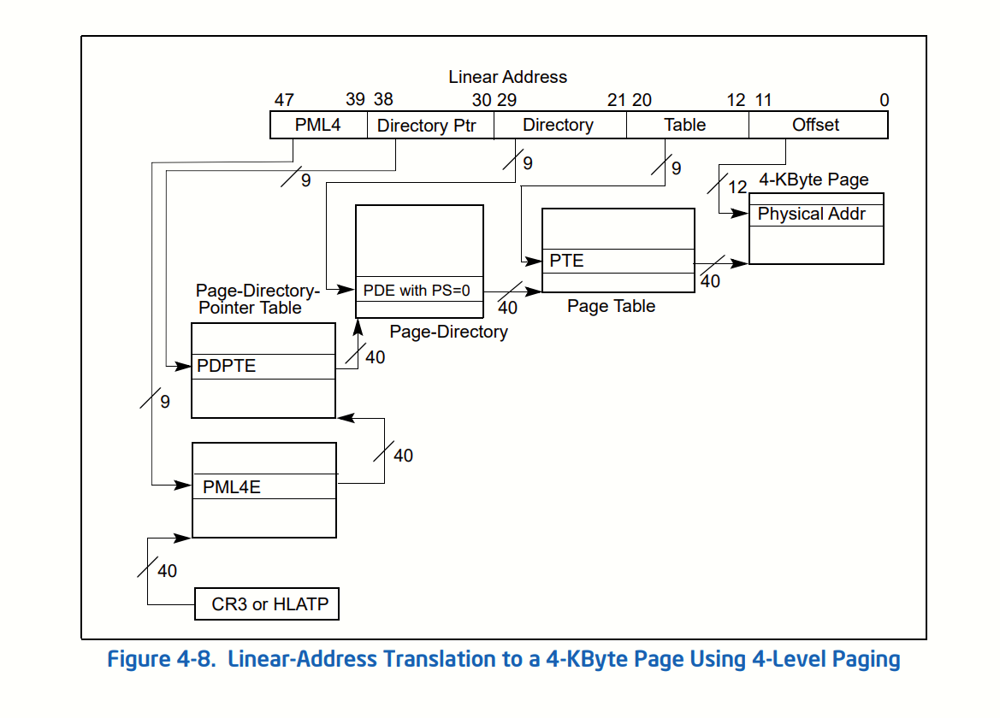

# Paging in Hyperlight

Hyperlight uses paging, which means the all addresses inside a Hyperlight VM are treated as virtual addresses by the processor. Specifically, Hyperlight uses (ordinary) 4-level paging. 4-level paging is used because we set the following control registers on logical cores inside a VM: `CR0.PG = 1, CR4.PAE = 1, IA32_EFER.LME = 1, and CR4.LA57 = 0`. A Hyperlight VM is limited to 1GB of addressable memory, see below for more details. These control register settings have the following effects:

- `CR0.PG = 1`: Enables paging
- `CR4.PAE = 1`: Enables Physical Address Extension (PAE) mode (this is required for 4-level paging)
- `IA32_EFER.LME = 1`: Enables Long Mode (64-bit mode)
- `CR4.LA57 = 0`: Makes sure 5-level paging is disabled

## Host-to-Guest memory mapping

Into each Hyperlight VM, memory from the host is mapped into the VM as physical memory. The physical memory inside the VM starts at address `0x0` and extends linearly to however much memory was mapped into the VM (depends on various parameters).

## Page table setup

The following page table structs are set up in memory before running a Hyperlight VM (See [Access Flags](#access-flags) for details on access flags that are also set on each entry)

### PML4 (Page Map Level 4) Table

The PML4 table is located at physical address specified in CR3. In Hyperlight we set `CR3=0x0`, which means the PML4 table is located at physical address `0x0`. The PML4 table comprises 512 64-bit entries.

In Hyperlight, we only initialize the first entry (at address `0x0`), with value `0x1_000`, implying that we only have a single PDPT.

### PDPT (Page-directory-pointer Table)

The first and only PDPT is located at physical address `0x1_000`. The PDPT comprises 512 64-bit entries. In Hyperlight, we only initialize the first entry of the PDPT (at address `0x1_000`), with the value `0x2_000`, implying that we only have a single PD.

### PD (Page Directory)

The first and only PD is located at physical address `0x2_000`. The PD comprises 512 64-bit entries, each entry `i` is set to the value `(i * 0x1000) + 0x3_000`. Thus, the first entry is `0x3_000`, the second entry is `0x4_000` and so on.

### PT (Page Table)

The page tables start at physical address `0x3_000`. Each page table has 512 64-bit entries. Each entry is set to the value `p << 21|i << 12` where `p` is the page table number and `i` is the index of the entry in the page table. Thus, the first entry of the first page table is `0x000_000`, the second entry is `0x000_000 + 0x1000`, and so on. The first entry of the second page table is `0x200_000 + 0x1000`, the second entry is `0x200_000 + 0x2000`, and so on. Enough page tables are created to cover the size of memory mapped into the VM.

## Address Translation

Given a 64-bit virtual address X, the corresponding physical address is obtained as follows:

1. PML4 table's physical address is located using CR3 (CR3 is `0x0`).
2. Bits 47:39 of X are used to index into PML4, giving us the address of the PDPT.
3. Bits 38:30 of X are used to index into PDPT, giving us the address of the PD.
4. Bits 29:21 of X are used to index into PD, giving us the address of the PT.
5. Bits 20:12 of X are used to index into PT, giving us a base address of a 4K page.
6. Bits 11:0 of X are treated as an offset.
7. The final physical address is the base address + the offset.

However, because we have only one PDPT4E and only one PDPT4E, bits 47:30 must always be zero. Each PDE points to a PT, and because each PTE  with index `p,i` (where p is the page table number of i is the entry within that page) has value `p << 21|i << 12`, the base address received in step 5 above is always just bits 29:12 of X itself. **As bits 11:0 are an offset this means that translating a virtual address to a physical address is essentially a NO-OP**.

A diagram to describe how a linear (virtual) address is translated to physical address inside a Hyperlight VM:

Diagram is taken from "The Intel® 64 and IA-32 Architectures Software Developer’s Manual, Volume 3A: System Programming Guide"

### Limitations

Since we only have 1 PML4E and only 1 PDPTE, bits 47:30 of a linear address must be zero. Thus, we have only 30 bits (bit 29:0) to work with, giving us access to (1 << 30) bytes of memory (1GB).

## Access Flags

In addition to providing addresses, page table entries also contain access flags that describe how memory can be accessed, and whether it is present or not. The following access flags are set on each entry:

PML4E, PDPTE, and PD Entries have the present flag set to 1, and the rest of the flags are not set.

PTE Entries all have the present flag set to 1.

In addition, the following flags are set according to the type of memory being mapped:

For `Host Function Definitions` and `Host Exception Data` the NX flag is set to 1 meaning that the memory is not executable in the guest and is not accessible to guest code (ring 3) and is also read only even in ring 0.

For `Input/Output Data`, `Page Table Data`, `PEB`, `PanicContext` and `GuestErrorData` the NX flag is set to 1 meaning that the memory is not executable in the guest and the RW flag is set to 1 meaning that the memory is read/write in ring 0, this means that this data is not accessible to guest code unless accessed via the Hyperlight Guest API (which will be in ring 0).

For `Code` the NX flag is not set meaning that the memory is executable in the guest and the RW flag is set to 1 meaning the data is read/write, as the  user/supervisor flag is set then the memory is also read/write accessible to user code. (The code section contains both code and data, so it is marked as read/write. In a future update we will parse the layout of the code and set the access flags accordingly).

For `Stack` the NX flag is set to 1 meaning that the memory is not executable in the guest, the RW flag is set to 1 meaning the data is read/write, as the user/supervisor flag is set then the memory is also read/write accessible to user code.

For `Heap` the RW flag is set to 1 meaning the data is read/write, as the user/supervisor flag is set then the memory is also read/write accessible to user code. The NX flag is not set if the feature `executable_heap` is enabled, otherwise the NX flag is set to 1 meaning that the memory is not executable in the guest. The `executable_heap` feature is disabled by default. It is required to allow data in the heap to be executable to when guests dynamically load or generate code, e.g. `hyperlight-wasm` supports loading of AOT compiled WebAssembly modules, these are loaded dynamically by the Wasm runtime and end up in the heap, therefore for this scenario the `executable_heap` feature must be enabled. In a future update we will implement a mechanism to allow the guest to request memory to be executable at runtime via the Hyperlight Guest API.

For `Guard Pages` the NX flag is set to 1 meaning that the memory is not executable in the guest. The RW flag is set to 1 meaning the data is read/write, as the user/supervisor flag is set then the memory is also read/write accessible to user code. **Note that neither of these flags should really be set as the purpose of the guard pages is to cause a fault if accessed, however, as we deal with this fault in the host not in the guest we need to make the memory accessible to the guest, in a future update we will implement exception and interrupt handling in the guest and then change these flags.**
