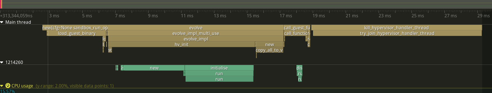

This is an example of using the tracing-tracy tracing-subscriber. When ran, it will generate traces that can be viewed in the tracy profiler.

You can run it with:

```console
TRACY_NO_EXIT=1 RUST_LOG=trace cargo run --package hyperlight-host --example tracing-tracy --profile release-with-debug
```

and then the client should show up in the profiler GUI:

